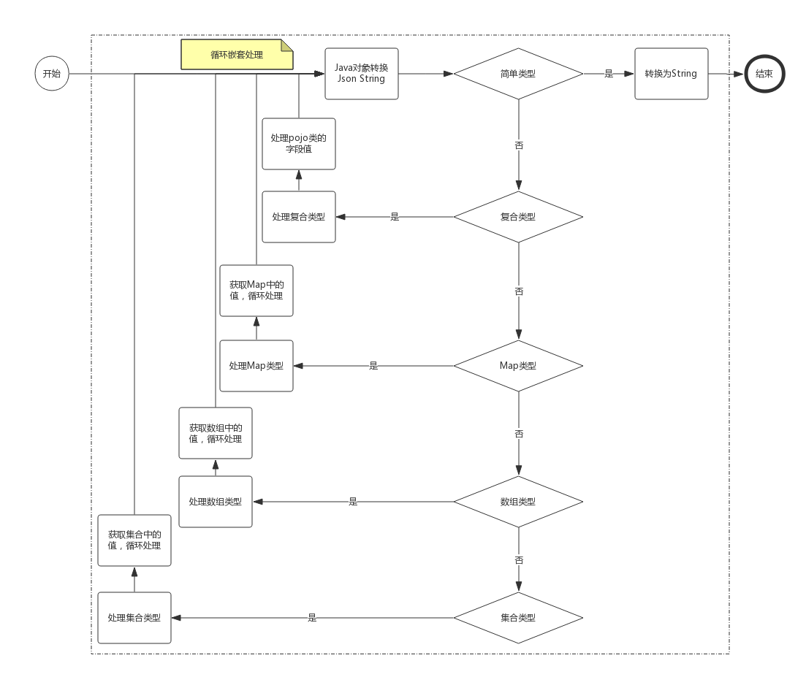
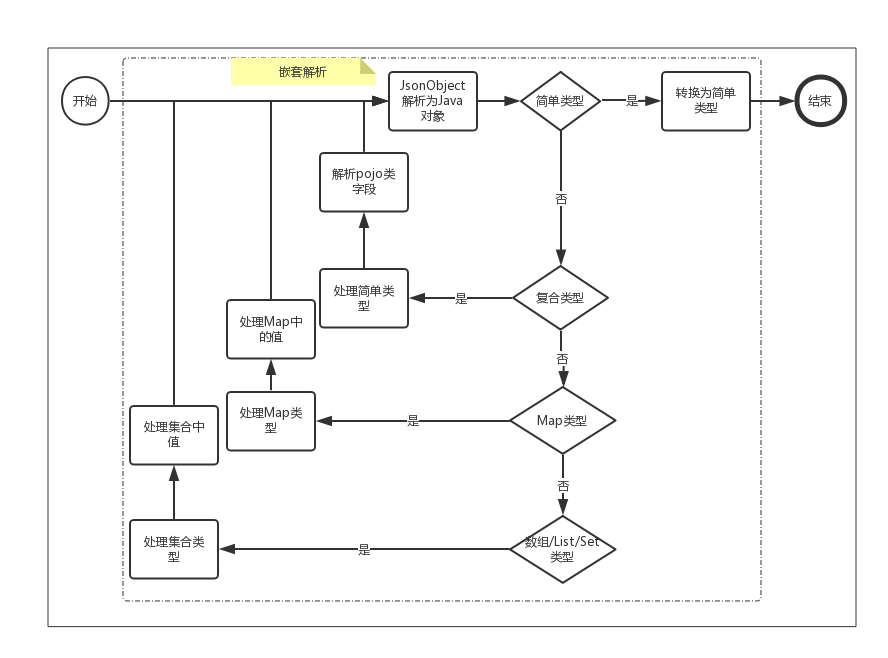

# Java实现一个简单的Json解析器
>基于Json进行数据传输在现在的互联网应用中已经非常非常广泛，所以了解Json数据结构是很有必要的。为了加深理解，自己动手实现一个简单的Json解析器。
实现Json解析器包括两方面：
a、将Java 对象转换为Json String
b、将Json String解析为Java对象

## 简单了解Json数据结构
>Json主要由如下两种结构和值组成：
Json Object，即为键值对方式，键只能为字符串类型，值则如常规字符串，数字，日期，对象，hash表，数组，集合等等。由“{”开头，“}”结尾，内由多组键-值组成，键-值中间用“：”隔开，键值与键值之前用“,”隔开，具体如下：

对于Java对象的类型，本文及其后面文章约定了几种类型的定义（可能定义有一定的局限性和不完整）：
<pre>1、简单类型
a)Java的8种基本类型及其包装类型
b)Java String类型
c)继承Java Number类的类型
2、Collection类型
a)实现Java Collection接口的类型
b)继承Java Collection 接口的类型
3、Map类型
a)实现Java Map接口类型
b)继承Java Map接口的类型
4、数组类型
即Java 中定义的数组类型
5、复合类型
以上类型除外</pre>
代码见TypeUtils.java：
<pre>
<code>
  /*

     * 即 boolean、byte、char、short、int、long、float 和 double
          * @see Class.isPrimitive()
        */
        public static boolean isPrimitiveType(Class<? clazz) {
        return clazz != null ? clazz.isPrimitive() : false;
            }
    
     public static boolean isPrimitiveWrapperType(Class<? clazz) {
        if (clazz != null) {
            // 抽象类 Number 是 BigDecimal、BigInteger、Byte、Double、Float、Integer、Long 和 Short 类的超类
            if (Number.class.isAssignableFrom(clazz)) {
                return true;
            } else if (Boolean.class.equals(clazz)) {
                return true;
            }
        }
        return false;
    }
    
    public static boolean isStringType(Class<? clazz) {
        return String.class.equals(clazz);
    }
    
    public static boolean isArray(Class<? clazz) {
        return clazz != null ? clazz.isArray() : false;
    }
    
    public static boolean isMap(Class<? clazz) {
        return isContainType(clazz, Map.class);
    }
    
    public static boolean isSet(Class<? clazz) {
        return isContainType(clazz, Set.class);
    }
    
    public static boolean isList(Class<? clazz) {
        return isContainType(clazz, List.class);
    }
    
    public static boolean isCollection(Class<? clazz) {
        return isContainType(clazz, Collection.class);
    }
    
    private static boolean isContainType(Class<? clazz, Class<? cClazz) {
        return cClazz.isAssignableFrom(clazz);
    }
    
    /**
     * 简单类型:原始类型，原始类型的包装类及String类型都归类为
     */
    public static boolean isSimpleType(Class<? clazz) {
        return isStringType(clazz) || isPrimitiveWrapperType(clazz) || isPrimitiveType(clazz);
    }
    
    /**
     * 复合类型：简单类型，集合，数组，Map除外
     */
    public static boolean isComplexType(Class<? clazz) {
        return !(isSimpleType(clazz) || isMap(clazz) || isList(clazz) || isSet(clazz) || isArray(clazz));
    }
</code
</pre

## 将Java 对象转换为Json String
>Java 对象转Json String大体流程如下：

1、对于输入的Java对象实例，首先判断是属于那种类型，然后根据不同类型分别进行处理，处理简单类型，其它都是需要进行嵌套处理，对于Map，集合，数组类型，还需要循环嵌套处理，最终底层来看都是根据简单类型进行处理，然后将处理结果统一到一个StringBuilder中返回。
2、简单类型处理，对应Json Value，直接将简单类型转换为String类型，然后返回。
3、复合类型处理，对应Json Object，这里只能处理pojo类，其它不符合该要求的，将无法解析。通过判断对象实例的getter，setter获取对应的字段名称，也即为key，然后通过getter方法获取值，再对值回到1中嵌套解析处理。
4、Map类型处理，也是对应Json Object，这里的Map中的key对应着Json key，通过循环迭代获取值，再对值回到1中嵌套解析处理。
5、数组/集合类型处理，也是对应Json Array，通过循环迭代获取值，再对值回到1中嵌套解析处理。
最后再将结果返回即可。
代码参考Json.java：
</pre>
<pre><code>
/* 将类转换为json格式字符串
     */
    public static String toJsonString(Object jsonObj) {
        if (jsonObj == null) {
            return null;
        }

        Class<? clazz = jsonObj.getClass();
        if (TypeUtils.isSimpleType(clazz)) {
            return toSimpleString(jsonObj);
        } else if (TypeUtils.isComplexType(clazz)) {
            // 复合类型对应的值的类型只有可能是Map，否则不解析
            return toComplexString(jsonObj);
        } else if (TypeUtils.isMap(clazz)) {
            return toMapString((Map) jsonObj);
        } else if (TypeUtils.isArray(clazz)) {
            return toArrayString(jsonObj);
        } else if (TypeUtils.isCollection(clazz)) {
            return toCollectString((Collection) jsonObj);
        }
        return null;
    }
</code</pre

# 将Json String解析为Java对象
相对于“将Java 对象转换Json String”更为复杂一些，这里分两步走：
第一步，将Json String 转换为一个Java JsonObject类，JsonObject类似一个树结构，用于存储Json信息。
第二步，将Java JsonObject类解析为Java对象实例。

## 将Json String 转换为一个Java JsonObject类：
>JsonObject实际就是对应Json结构，val-Json Value（val只能是Java String，Java Map，Java Lis，其中Map-Json Object，List-Json Array），key- Json key三种结构，由于是嵌套的，所以还定义了一个parent，具体见Json#JsonObject.java:

<code
static class JsonObject {

        private JsonObject parent;
    
        private String key;
    
        private Object val;
    
        public JsonObject(JsonObject parent, String key, Map<String, Object val) {
            this.parent = parent;
            this.key = key;
            this.val = val;
            relateParent(parent, key, val);
        }
    
        public JsonObject(JsonObject parent, String key, List<Object val) {
            this.parent = parent;
            this.key = key;
            this.val = val;
            relateParent(parent, key, val);
        }
    
        /**
         * 与父类建立关系
         */
        @SuppressWarnings("unchecked")
        private void relateParent(JsonObject parent, String key, Object val) {
            if (parent != null && val != null) {
                Object pVal = parent.getVal();
                if (pVal != null) {
                    if (pVal instanceof Map && CommonUtils.isNotEmpty(key)) {
                        ((Map<String, Object) pVal).put(key, val);
                    } else if (pVal instanceof List) {
                        ((List<Object) pVal).add(val);
                    }
                }
            }
        }
    
        public JsonObject getParent() {
            if (parent == null) {
                parent = this;
            }
            return parent;
        }
    
        public String getKey() {
            return key;
        }
    
        public Object getVal() {
            return val;
        }
    
        @Override
        public String toString() {
            return val != null ? val.toString() : null;
        }
    
    }
</code

>将Json String解析为JsonObject流程图：
最终解析出来的是一个JsonObject对象实例，该对象实例中又包含了子JsonObject，就像一个树结构，具体代码如下：
<pre><code>
private static JsonObject toJsonObject(String jsonStr) {
        if (CommonUtils.isEmpty(jsonStr)) {
            return null;
        }
        JsonObject jb = null;
        StringBuilder sbd = new StringBuilder();
        char[] jcs = jsonStr.toCharArray();
        int jLen = jcs.length;
        String key = null;
        String val = null;
        Object jVal = null;
        char jc;
        for (int index = 0; index < jLen; index++) {
            jc = jcs[index];
            if (jc == '{') {
                // 初始化为Map
                jb = new JsonObject(jb, key, new HashMap<String, Object());
            } else if (jc == '[') {
                // 初始化为List
                jb = new JsonObject(jb, key, new ArrayList<Object());
            } else if (jc == ':') {
                // 获取key
                key = getAndCleanSbdStr(sbd);
            } else if (jc == ',' || jc == '}' || jc == ']') {
                // 获取val
                val = getAndCleanSbdStr(sbd);
                // 处理值
                if (jb != null && CommonUtils.isNotEmpty(val)) {
                    jVal = jb.getVal();
                    if (jVal instanceof Map && CommonUtils.isNotEmpty(key)) {
                        ((Map<String, Object) jVal).put(key, val);
                    } else if (jVal instanceof List) {
                        ((List<Object) jVal).add(val);
                    }
                }

                // 当前对象处理介绍，回退到上一个对象
                if (jc == '}' || jc == ']') {
                    jb = jb.getParent();
                    key = jb.getKey();
                }
            } else {
                sbd.append(jc);
            }
        }
        return jb;
}
</code></pre>

## 将Java JsonObject类解析为Java对象实例
>这里会有两个参数，一个是Java JsonObject实例值，一个是目标Java对象class，转换后的结果是目标Java对象实例。如《Java实现一个简单的Json解析器（一）》提到的本文的Java对象类型分类，分别对目标Java对象的类型进行判断，根据不同类型，分别做不同的类型解析处理，解析流程如下：
有几个地方需要重点说明一下：
>1、整个解析过程是嵌套执行，目标Java对象的类型和JsonObject对象的类型能对应上才能解析，否则可能被丢弃，对应关系大体如下：
>(1)目标Java对象为简单类型，则JsonObject对象的值可以为任意类型，但解析是强制转换为String再进行解析。
>(2)目标Java对象为复合或者Map类型，则JsonObject对象的值只能为Map类型。
>(3)目标Java对象为集合或者数组类型，则JsonObject对象的值只能为集合类型。
>2、对于目标Java对象为非简单类型时，需要判断出pojo类中的字段，或者Map，数组，集合中定义的值对应哪个Java类（比如byte[String]，则定义的值为String.class类，又比如Map<String,TestDto，则定义的值为TestDto.class类，若无法确定，则取默认的Java的Object.class），以便作为新的目标Java对象进行嵌套解析，最终最底层都是调用简单类型进行处理，具体代码见如下：
>
<pre
<code
private static Class<? getComponentType(Type gType) {
  CommonUtils.debugLog("type is " + gType);
  if (gType instanceof Class) {
      Class<? clazz = (Class<?) gType;
      if (TypeUtils.isArray(clazz)) {
          return clazz.getComponentType();
      }
  }
  if (gType != null) {
      if (gType instanceof ParameterizedType) {
          Type[] ctgs = ((ParameterizedType) gType).getActualTypeArguments();
          if (ctgs.length  0) {
              // collection，map等，只取最后一个参数
              return (Class<?) ctgs[ctgs.length - 1];
          }
      } else if (gType instanceof WildcardType) {
          return (Class<?) ((WildcardType) gType).getUpperBounds()[0];
      } else if (gType instanceof GenericArrayType) {
          return (Class<?) ((GenericArrayType) gType).getGenericComponentType();
      } else if (gType instanceof TypeVariable) {
          return (Class<?) ((TypeVariable) gType).getBounds()[0];
      }
  }
  return Object.class;
}
</code
</pre

>3、对于目标Java对象中有些字段使用接口进行定义，若无法找到具体的实现类时，则通过Java代理实现setter和getter方法，代码实现如下：
<pre><code>
static class JsonInvocationHandler implements InvocationHandler {

        private Map srcVals = null;
    
        private Map<String, Object vals = new HashMap<String, Object();
    
        public JsonInvocationHandler(Map srcVals) {
            this.srcVals = srcVals;
        }
    
        @Override
        public int hashCode() {
            int code = 1;
            for (Object obj : vals.values()) {
                if (obj != null) {
                    code = code * 31 + obj.hashCode();
                }
            }
            return code;
        }
    
        @Override
        public Object invoke(Object ins, Method m, Object[] valObjs) throws Throwable {
            // 重点代理实现getter和setter方法
            try {
                String mName = m.getName();
                Type[] pts = m.getGenericParameterTypes();
                Class<? retType = m.getReturnType();
                if (pts.length == 1 && retType.equals(void.class)) {
                    if (mName.startsWith("set")) {
                        String fieldName = MethodUtils.getFieldName(m, "set");
                        vals.put(fieldName, valObjs[0]);
                    }
                } else if (pts.length == 0 && !retType.equals(void.class)) {
                    if (mName.startsWith("get")) {
                        String fieldName = MethodUtils.getFieldName(m, "get");
                        if (fieldName != null) {
                            if (!vals.containsKey(fieldName)) {
                                return convertVal(pts, retType, fieldName);
                            } else {
                                return vals.get(fieldName);
                            }
                        }
                    } else if (mName.startsWith("is")) {
                        String fieldName = MethodUtils.getFieldName(m, "is");
                        if (fieldName != null) {
                            if (!vals.containsKey(fieldName)) {
                                return convertVal(pts, retType, fieldName);
                            } else {
                                return vals.get(fieldName);
                            }
                        }
                    } else if (mName.startsWith("toString")) {
                        Set<String keySet = srcVals.keySet();
                        for (String fileName : keySet) {
                            if (!vals.containsKey(fileName)) {
                                Object srcVal = srcVals.get(fileName);
                                if (srcVal != null) {
                                    Method getM = null;
                                    String upperField = fileName.substring(0, 1).toUpperCase() + fileName.substring(1);
                                    try {
                                        getM = srcVal.getClass().getMethod("get" + upperField, null);
                                    } catch (Exception e) {
                                        e.printStackTrace();
                                        try {
                                            getM = srcVal.getClass().getMethod("is" + upperField, null);
                                        } catch (Exception e2) {
                                            e2.printStackTrace();
                                        }
                                    }
                                    if (getM != null) {
                                        convertVal(null, getM.getReturnType(), fileName);
                                    }
                                }
                            }
                        }
                        return vals.toString();
                    } else if (mName.startsWith("hashCode")) {
                        return this.hashCode();
                    }
                }
            } catch (Exception e) {
                e.printStackTrace();
            }
    
            return null;
        }
    
        private Object convertVal(Type[] pts, Class<? retType, String fieldName) {
            // 值获取不到时，初始化转换
            Object retSrcVal = srcVals.get(fieldName);
            if (retSrcVal != null) {
                // 做值转换
                Class<? cType = getComponentType((pts != null && pts.length  0) ? pts[0] : retType);
                Object retVal = parseObjectInner(retType, retSrcVal, cType);
                if (retVal != null) {
                    vals.put(fieldName, retVal);
                }
                return retVal;
            }
            return null;
        }
    }
</code</pre

# 可优化地方
<pre>
1、日期（格式）处理
2、数值的处理，如科学计数法转换等
3、字符串编码处理，避免出现解析或者转换的乱码
4、格式化输出处理
5、性能和容错处理
</pre>

# 总结
<pre>
1、理解Json数据结构基础上，通过与Java语言特性进行对应，实现Json解析器功能
2、划分类型，针对不同类型进行不同的处理，类型最终处理都归结为简单类型的处理
3、针对复合类型处理，需化繁为简进行处理
4、针对集合或者Map类型处理，首先要能够提取集合中对象的类型或者值，然后进行循环处理
5、理解代理实现类
</pre>

# 参考
>Json介绍：http://www.json.org/
>阿里巴巴Fastjson：https://fastjson.codeplex.com/
